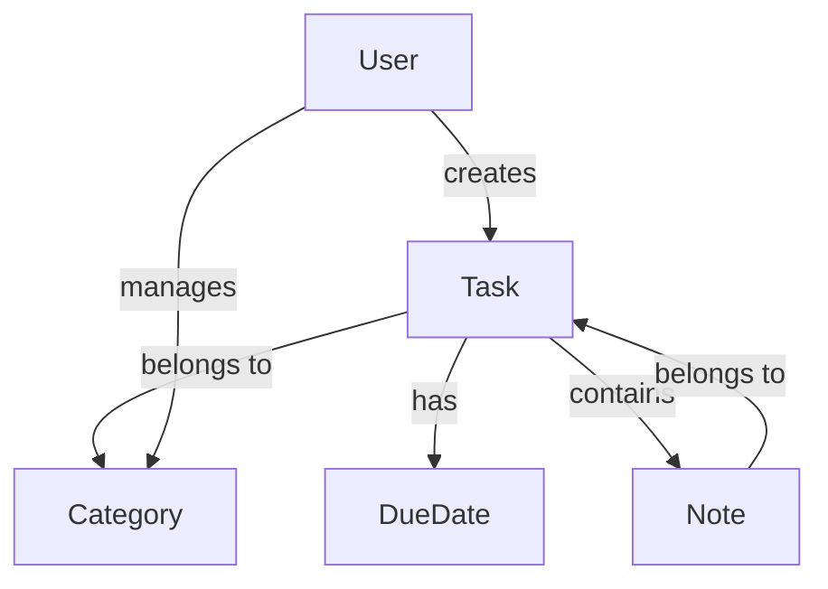

# Todo App

A Todo application to manage tasks and notes efficiently.

## Features

- Add, edit, update, and delete tasks
- Add, edit, update, and delete notes
- Mark tasks as completed
- Categorize tasks
- Set due dates

## Installation

```sh
# Clone the repository
git clone https://github.com/abrahamkiplagat/to-do_list_notes_app.git
cd todo-app

# Install dependencies
npm install
flutter pub get

# Start the application
npm start
flutter run
```

## Usage

1. Open the application.
2. Create a new task by providing a title and optional details.
3. Add notes related to tasks.
4. Mark tasks as completed when done.
5. Delete tasks or notes that are no longer needed.

## Entity Relationship Diagram (ERD)



## Technologies Used

- **Frontend:** Flutter responsive design
- **Backend:** Flutter (Dynamic Advanced Robotic Technologies)
- **Database:** MongoDB / PostgreSQL

## Contributing

1. Fork the repository.
2. Create a new branch (`feature-branch`).
3. Commit your changes.
4. Push to the branch and create a pull request.

## License

This project is licensed under the MIT License.
